^ This is my work in progress for my CocoaConf 2016 presentation. This file is Markdown specifically formatted for presentation in Deckset, so it may look a bit funky if you're viewing it on GitHub.

---

# A Game 
# of Things
## (W)inter(net) is coming.

^ * Intro to me, MM

^ * Rise of IoT

^ * What we'll be covering

----


^ The Iron Throne

^ * So, anytime you reference A Game of Thrones in a technical presentation, you have to include a photo of The Iron Throne for at least seven minutes. It's a law now. Congress passed in in 2014. Look it up.

^ * First result from google images was this


----


^ And yes, that was only three slides to get to a toilet joke. That's my new record for a CocoaConf talk.


----


^ But this talk isn't *about* A Game of Thrones. It's about the Internet of Things, and how to build stuff for it. But congress passed that law about the picture of the throne! And I don't want to make you all complicit in a federal crime. So, because I've got to get on with my topic, but have to keep this image up for six and a half more minutes, I present to you…The Connected Iron throne.

----


^ The Connected Iron Throne

^ * Why a connected throne?

^ * Health reasons: reminds you to stand up every hour.

----

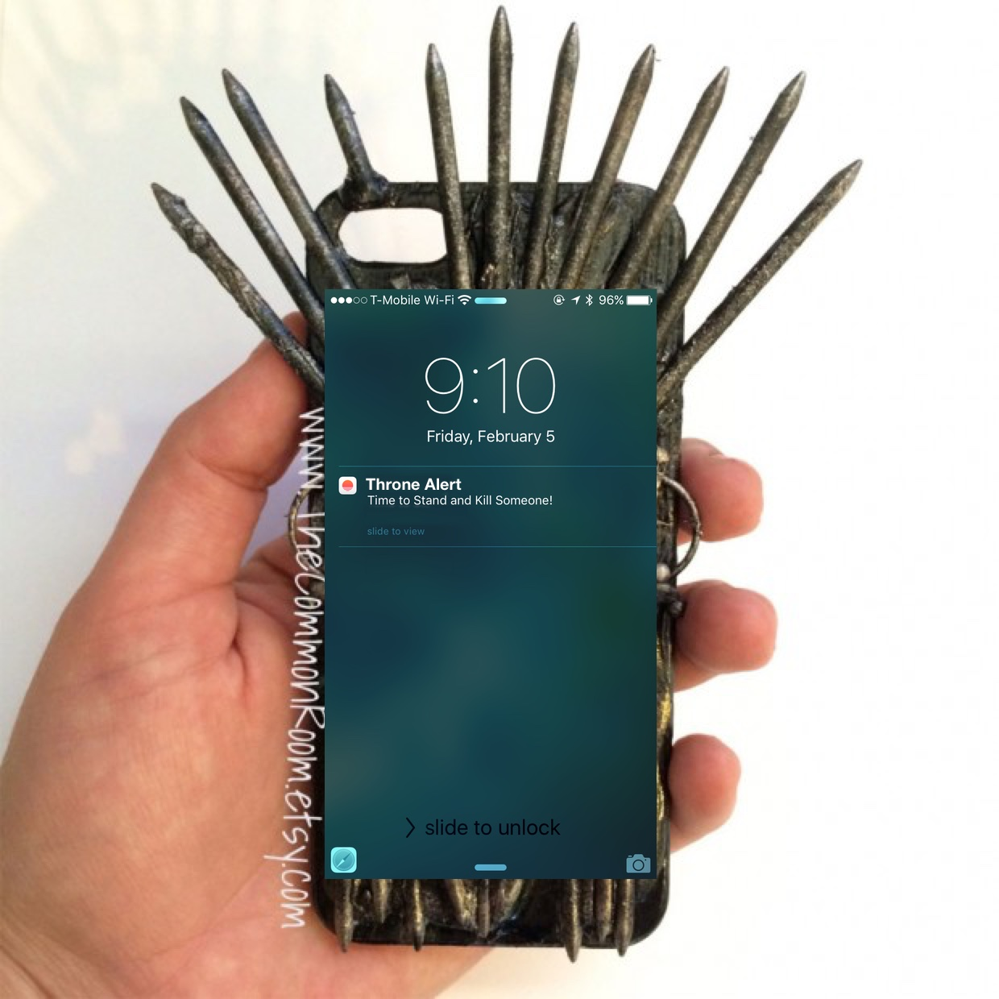 

^ * Court can use "Iron Phone" to trigger assassination alerts.

----


^ * Let's talk about system architecture

^ * Don't worry if you don't fully understand this yet

^ * Just note sensors & actuators <-> Microcontroller <-> Cloud <-> Client

----


# [Fit] Sensors & Actuators

^ * Device must interact w/world

^ * Brain : Senses/Body :: Microcontroller : Sensors/Actuators

^ * Fancy word: Actuator: a device, such as a motor or light, that affects the world under electronic control. 

----

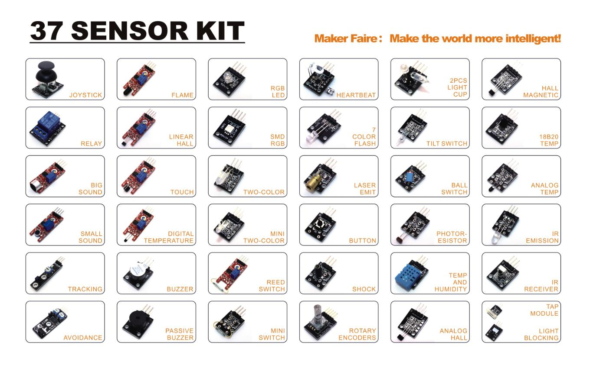

^ * These components are commodity devices.

^ * There are a ton of these out there in the world.

^ * Common sensors: light, temperature, motion, proximity, acceleration, rotation, and orientation. 

^ * Common actuators: motors, speakers, lights, relays, etc.

---

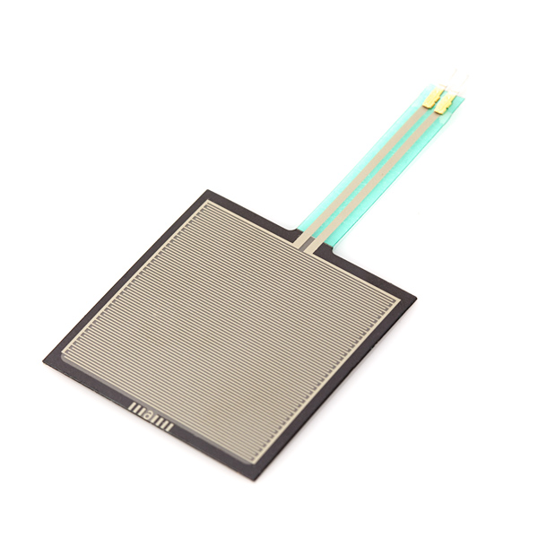
#[Fit]Pressure Sensor

^ * Pressure sensor installed under the seat

^ * High resistance, gets lower as pressure is applied.


----


#[Fit] Vibration Motor

^ We also need a vibration motor, which we'll attach to the throne's frame as well. 

----


# [Fit] A Microcontroller
##\(with wireless)

^ * Microcontroller == Tiny Computer

^ * Most designed to interact w/sensors & actuators

^ * Also need wireless:

^ * Bluetooth: very low power, but requires a nearby host. (BLE 4.2 changes this with 6LoWPAN.)

^ * Wifi: Can connect directly to the internet if there's an access point

^ * Cellular: More expensive, but much better coverage

^ * Many microcontrollers available. Stick with popular ones.

----


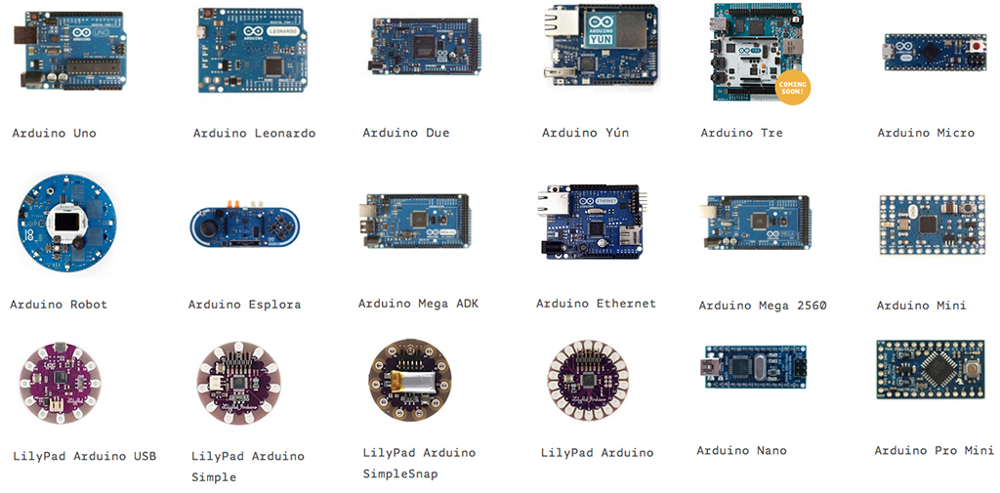

##[Fit] Arduino

^ * First arduino introduced in 2005, rapidly became a hobbyist favorite. 

^ * Open-source hardware & software. 

^ * Myriad hardware options available, some starting at about $8. 

^ * Comes with its own Java-based IDE. 

^ * Uses C-like language; easy to get the hang of. 

^ * Connectivity is a bit of a challenge and gets expensive (wifi shield $40-$50).

----

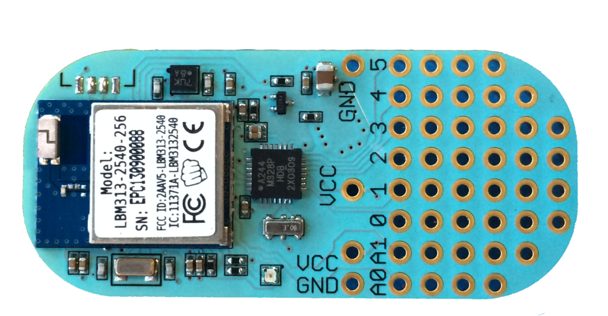

# [Fit] Light Blue Bean

^ * *lots* of Arduino-compatible spinoffs 

^ * We've had particular fun with the Light Blue Bean, which has Bluetooth LE support built in to it

^ * Can run for months on a single coin cell battery.

^ * Tell about Dorothy http://observer.com/2014/10/dorothy-wearable-device-lets-you-escape-blind-dates-by-clicking-your-heels/

----

.jpg)

## [Fit]Raspberry Pi
 
^ * First introduced in February 2012, Raspberry Pi 2 in 2014, Pi 3 in 2016.

^ * Complete ARM computer on a board for $35. Hook up keyboard and monitor.

^ * Usually runs Linux. (Windows 10 and Android also available.)

^ * Hugely popular, has decent processing capabilities, I/O.  

^ * Requires $10 USB wifi dongle to get it on a network, or onboard with Pi 3.

^ * Python by default, but supports a wide variety of languages.
 
----
 
 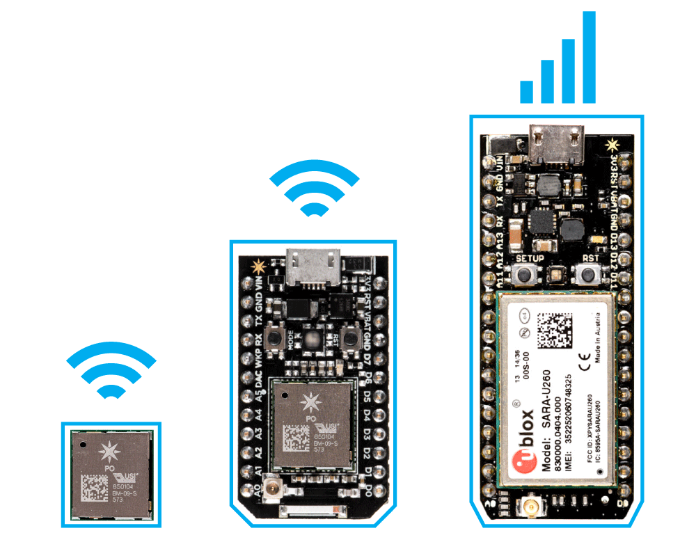
 
##[Fit] Photon/Electron

^ * Particle.io's development boards. 

^ * The Photon is $19 w/Wifi

^ * $39 Electron has cell radio & SIM card for data.

^ * Programmed like Arduino

^ * Can be programmed over the air using Particle's web-based IDE. 

^ * Designed to work with the free Particle.io service.

----

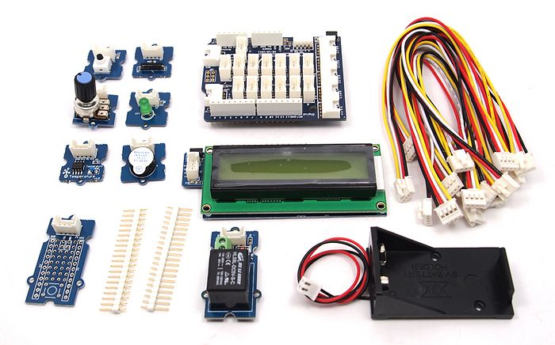

## [Fit] Grove System

^ * Combination of a base shield and modularized components for plug & play prototyping.

^ * Works with a variety of microcontrollers

^ * Modular sensors and actuators will work with any supported platform.

----


# [Fit] A Backend Service

^ * A known destination for your device to send information to. 

^ * Devices use web services or MQTT (MQ Telemetry Transport -- MQ == "Message Queueing") to communicate w/backend.

^ * Backend can log data, it available to clients via a web service, send push notifications, create reports, etc

^ * Communication hub for your IoT device service.

----


^ * Designed to work with the Photon and Electron.

^ * Other microcontrollers, e.g. Digistump's Oak, using Particle too. 

^ * Nice, clean REST API,

^ * Relies on web standards for communication, event notification, and authentication.

----
 
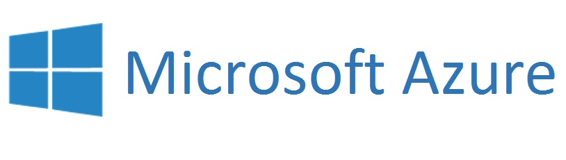

^ * Micosoft Azure IoT: http://www.microsoft.com/en-us/server-cloud/internet-of-things/azure-iot-suite.aspx. 

^ * Provides Monitoring, Asset Management, and Analytics/Predictive Maintenance

^ * Tailored to utilities, installed machinery (like elevators), factory monitoring and automation, etc.

----

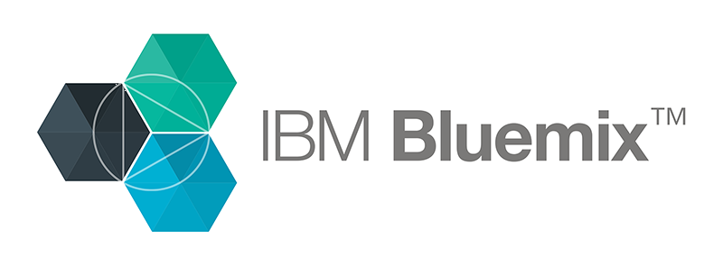

^ * Similar to Microsoft's: enterprise grade services with an emphasis on large-scale management. 

^ * IBM has an excellent local presence, supports iOS community

----
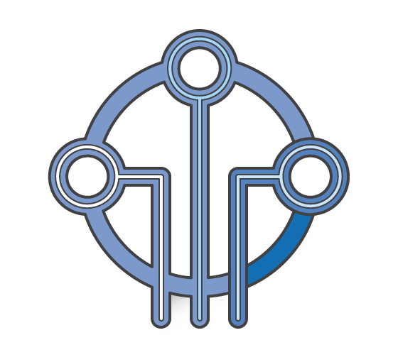

# [Fit]Amazon Web Services IOT

^ * Adds "shadow" devices: write updates to offline devices; applied when they next connect. 

^ * Rules engine: run SQL queries against data, act automatically on it. Good for DB export, alerts, etc. 

^ * Works well with other tools in Amazon's cloud suite. 

^ * SDKs for C, Node, Arduino, and Mobile. 

^ * Permission restrictions on particular devices. 

----


^ * Many other good backend services (Lambda, e.g.) could be used for IoT, but which aren't tailored for it.
 
---- 


^ * "IF this THEN that". 

^ * Allows mere mortals to set up conditional logic

^ * Integrations to a huge variety of services. 

^ * E.g., trigger a Hue light to turn red, text the paramedics your GPS location when you log a 180/110 blood pressure on your Withings blood pressure cuff.

^ * Point out that every logo is blue. Go figure.

----


# [Fit] The Client

^ * Typically a mobile or desktop computer that talks with backend service. 

^ * CocoaConf, therefore we'll consider iOS.

^ * Approach varies per communication tech.

^ * For BLE, CoreBluetooth to talk to device directly.

^ * If Wifi, REST calls, either to device or to backend service.

^ * For cellular, REST calls to backend.

^ * Many services provide SDK to make communication coding easier.

----


^ * Not the only architecture possible

^ * Client <-> Microcontroller w/Bluetooth or wifi

^ * Without backend, it's tough/impossible to interact w/device from far away

^ * We favor this architecture for max flexibility

^ * Any questions about how these pieces fit together?

----

# [Fit]Let's Build It!

^ * Let's start to put this thing together! 

^ * Standard sensors and actuators. 

^ * Microcontroller: Photon. (Built-in wifi and reasonable price.) (Plus, I wanted an excuse to buy one.)

^ * Backend: Particle.io. It is tightly integrated with the Photon and has a really nicely thought-out REST API.

^ * Client: iOS app. (This *is* CocoaConf, after all.)

^ * Let's take a closer look at each layer.

----
# Vocabulary

* **Pin**: one of the connectors on the edge of the microcontrollers to which wires can be attached.
* **High/Low**: Indicate whether a pin has current run through it or not.
* **Digital/Analog**: Whether microcontroller inputs/outputs are treated as on/off, or as continuously variable values.
* **GPIO**: General purpose input/output

----


#[Fit]Pressure Sensor

^ * It's analog -- reports not just occupancy, but weight.

^ * It's a variable resistor: 20MOhms -- very high when unoccupied. More pressure == less resistance 

^ * We'll respond if the resistance goes below a threshold value.

----

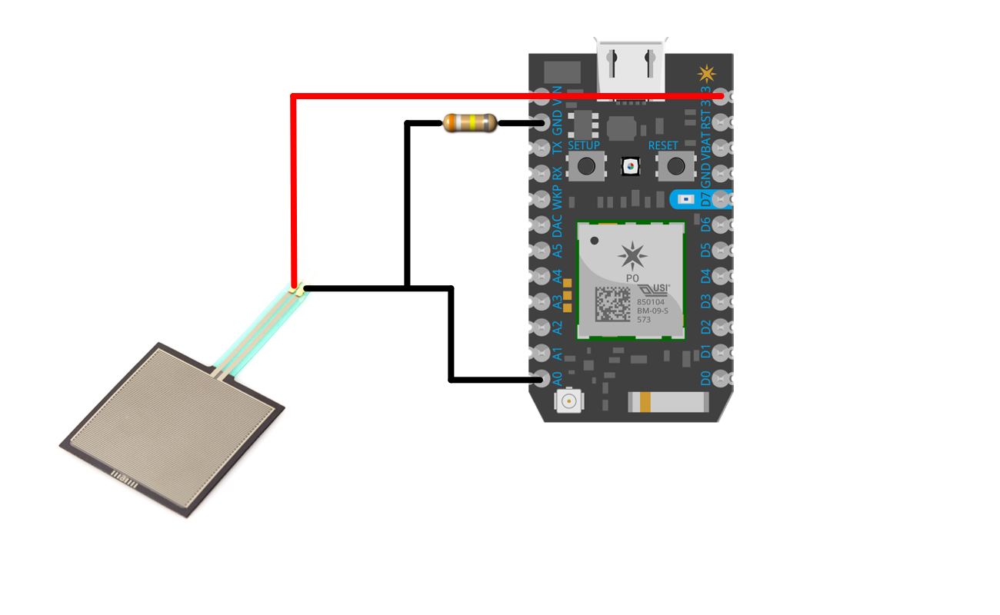

^ * Here's how we wire up the pressure sensor. One leg to power, one to an anolog input.

^ * Use a pulldown resistor to make sure our wiring isn't acting as an antenna and picking up random values.

----

```c
int pressureSensorPin = A0;
int pressureReading;
int pressureThreshold = 100;
bool wasThroneOccupied = false;

void setup()
{
    pinMode( pressureSensorPin, INPUT );
    Particle.variable("pressure", pressureReading);
}
```

^ * Don't worry about understanding everthing; just get a sense.

^ * Business logic is usually elsewhere in the architecture; focused on dealing with the inputs and outputs 

^ * Looks a lot like C; it more-or-less is.

^ * Most microcontrollers use a similar subset of C & library functions to support interacting with inputs and outputs

^ * Also hardware-specific additions for unique features

^ * Two special functions: `setup()` and `loop()`. 

^ * Setup gets called once when the system powers up or is reset. 

^ * We configure input pin for pressure sensor & expose a variable to the REST API.

----

```c
void loop()
{
   pressureReading = analogRead( pressureSensorPin );
   
   bool isThroneOccupied = pressureReading > pressureThreshold;
   if ( isThroneOccupied && !wasThroneOccupied ) {
       Particle.publish( "throneStatus", "occupied" );
   }
   if ( !isThroneOccupied && wasThroneOccupied ) {
       Particle.publish( "throneStatus", "vacant" );
   }
   wasThroneOccupied = isThroneOccupied;
}

```

^ * Loop gets called over and over until your controller gets reset. 

^ * We read the value from the pressure sensor pin and assign it to our variable. 

^ * We've already linked the variable to the REST endpoint, so we can now query the value of our pressure sensor through the REST API.


----


#[Fit] Vibration Motor

^ * Here's our vibration motor.

^ * Some motors can be driven by directly from a microcontroller. 

^ * Bigger ones require a transistor or relay and a seperate power source. 

^ * We're choosing one that can be connected directly to the controller.

----

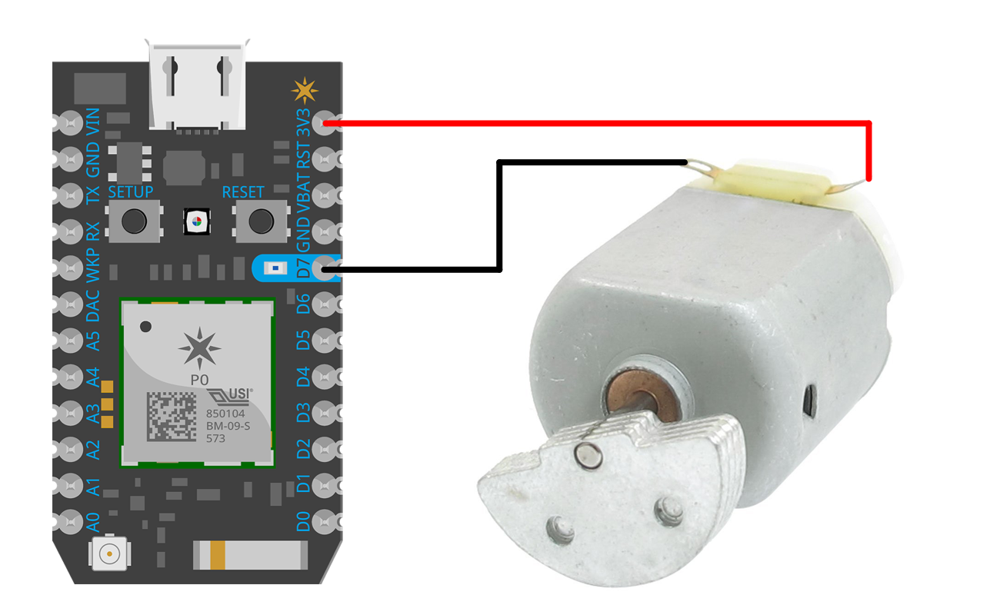

^ * Electricity makes a circuit, so we connect it to power, but until we let the electrons back in D7, the motor doesn't run.

---


^ * Here's setup code for the motor. 

^ * We set the mode for ditial pin 7 to OUTPUT. 

^ * digitalWrite allows us to turn the motor on and off. We set the pin LOW to make sure it's off when we start.

^ * We register a function by telling the Particle library what the public name that's exposed to the REST service will be, and then reference a function in our code. 

^ * Note: functions' public name is limited to 12 characters, and we can only have four functions per device, due to memory constraints. (Particle restrictions.)

```c
int vibrationMotorPin = D7;

void setup()
{
   pinMode( vibrationMotorPin, OUTPUT );
   digitalWrite( vibrationMotorPin, LOW );
   
   Particle.function( "notify", notify );
}
```

----

^ * Here's the referenced function for the rest endpoint. 

^ * All functions in the Particle ecosystem take a string as input, and return an integer.

^ * If you need to get other data types out of your particle, just can expose those data as variables. 

^ * We check the parameter and see if we're getting a notification of an assassination. (Allows us to support other types of notifications in the future.)

```c
int notify( String notification ) {
    if ( notification == "assassination" ) {
        notifyAssassination();
        return 0;
    }
    
    return -1;
}
```
----
^ * We're setting it up to do four half-second pulses by turning the pin on for 500ms, then off for 500ms.

```c
void notifyAssassination() {
    for ( int i = 0; i < 4; i++ ) {
        digitalWrite( vibrationMotorPin, HIGH );
        delay( 500 );
        digitalWrite( vibrationMotorPin, LOW );
        delay( 500 );
    }
}

```

---

```
int standInterval = 1000 * 60 * 60;
int lastStandTime;

void loop()
{
    pressureReading = analogRead( pressureSensorPin );
    
    bool isThroneOccupied = pressureReading > pressureThreshold;
	...    
    if ( isThroneOccupied ) {
        if ( lastStandTime + standInterval < millis() ) {
            notifyTimeToStand();
        }
    } else {
        lastStandTime = millis();
    }
    
    delay( 500 );
}

```

^ * Again, most of the business logic is usually elsewhere. 

^ * For standing reminders, the microcontroller already has all of the information it needs.

^ * Even if we lose connectivity, the stand alert will still work. Handling it locally also reduces data usage.

---

#[Fit]Client App 
#[Fit]for the Court


^ * Most cloud services have already written libraries for making the microcontroller communicate with the service. 

^ * On the microcontroller we use a library; and on the client by either using REST calls or by using another library. 

^ * Here we use Particle's library for iOS to make things as straightforward as possible.

---

 

^ * A status indicator that shows when someone most recently took the throne.

^ * Button at the bottom that allows the member of the court to send an assassination alert.

----

```ruby
use_frameworks!

target 'IronCourt' do
	pod "Spark-SDK"
end
```

^ * First, get the library into our project. 

^ * Particle uses Cocoapods; add the appropriate pod to our Podfile and run `pod update`.

^ * Note: if we're using Swift, we need to include the use_frameworks! command as well.

^ * "Spark" naming is legacy from before company was renamed to Particle.

----

^ * To keep our architecture clean, we create a ParticleManager that wraps up all our Particle-related code.

^ * Uses delegate pattern to communicate with other parts of the app.

^ * Initializing the class starts a login attempt.

```swift
protocol ParticleManagerDelegate {
    func didReceiveAssassinationAlert()
    func didRecieveOccupantUpdate()
}

class ParticleManager {
	...
	let delegate : ParticleManagerDelegate
    
    init( delegate: ParticleManagerDelegate ) {
        self.delegate = delegate
        
        self.loginToParticle()
    }
	...
}

```

----

^ * Here's login logic.

^ * Username and password in a .plist, since I'm a dummy and would check them in otherwise.

^ * If we don't get an error back, all is well. 

^ * Move on to locating the particular Photon device in our acccount.

```swift
    private func loginToParticle() {
        let ( username, password ) = self.getUsernameAndPasswordFromPlist()
        
        SparkCloud.sharedInstance().loginWithUser(username, password: password) { (error:NSError!) -> Void in
            if let error = error {
                print("Wrong credentials or no internet connectivity, please try again. Error: " + 
					error.localizedDescription )
            } else {
                print("Logged in")
                self.findPhoton()
            }
        }
    }
    
```

----

^ * Get a list of Photons registered to our account and iterate through them to find the one named "iron-throne." 

^ * Stash it in a property, and we're all set up! 

^ * We'll come back to that `subscribeToEvents()` call in a moment.

```swift
    private func findPhoton() {
        SparkCloud.sharedInstance().getDevices { (sparkDevices:[AnyObject]!, error:NSError!) -> Void in
            
            guard let devices = sparkDevices as? [SparkDevice]
                else {
                    print( "Could not get list of devices." )
                    return
            }
            
            for device in devices where device.name == "iron-throne" {
                self.ironThronePhoton = device
                self.subscribeToEvents()
            }
        }
    }
```
---

 

^ * Groundwork laid. Let's make the button work.

--- 

```
    final func sendAssassinationAlert() {
        ironThronePhoton?.callFunction("notify",
            withArguments: ["assassination"],
            completion: nil );
    }
```

^ * Remember in microcontroller code, we created a function called "notify", checked for "assassination" parameter.

^ * Here's the other end of that. 

^ * We call that "notify" function, and pass it a single argument, the string "assissanation". 

^ * We don't need completion black, it's fire-and-forget.

---

```
    private func subscribeToEvents() {
        self.subscriberId = SparkCloud.sharedInstance().
			subscribeToMyDevicesEventsWithPrefix("throneStatus", 
			handler: eventHandler )
    }
	
    ...
	
    private func eventHandler( event: SparkEvent!, error: NSError! ) {
        print("Got event: " + event.event + "; " + event.data)
        if event.event == "throneStatus" {
            self.delegate.didRecieveOccupantUpdate( event.data )
        }
    }

```

^  * Let's watch for updates on whether the throne is occupied

^ * When that status changes, update our UILabel. 

^ * Microcontroller is already publishing events whenever the pressure switch's status changed

^ * We use the iOS SDK's library to subscribe to those events. 

^ * (Remember that `subscribeToEvents()` call from before? This is where it went.) 


---

```
    final func didRecieveOccupantUpdate(status: String) {
        let dateString = dateFormatter.stringFromDate( NSDate() )
        
        dispatch_async(dispatch_get_main_queue()) { () -> Void in
            let labelText = "\(dateString): \(status)"
            self.statusLabel.text = labelText
        }
    }
```

^ And, of course, here's the code in the view controller (which is the Manager's delegate.) It'll all standard iOS stuff here.

---


^ * Sensors/actuators. We've seen what's available, how to hook a few up.

^ * Microcontroller: We've looked at a number of available options, seen how to write code.

^ * Cloud Service: We've looked at options, seen ways of interacting with them.

^ * Client: Have seen how to write a basic client, tie it into the familiar world of iOS.

---


#[Fit]Q&A

---

## [Fit]https://github.com/SeanMcTex/game-of-things

sean.mcmains@mutualmobile.com
@SeanMcTex
http://www.mcmains.net
