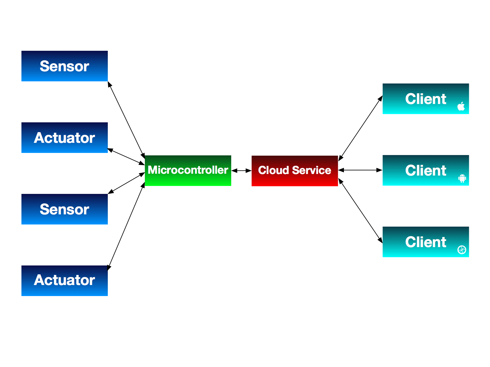

^ This is my work in progress for my CocoaConf 2016 presentation. This file is Markdown specifically formatted for presentation in Deckset, so it may look a bit funky if you're viewing it on GitHub.

# A Game 
# of Things
## (W)inter(net) is coming.

^ Introduction: I'm Sean McMains. I'm an Associate Director of iOS at [redacted] here in Austin. Until very recently, we were Mutual Mobile, but figured that six years old was about the right time for a tech company to have a midlife crisis, so we bought a convertible, got highlights in our hair, and changed our name. 

^ No, seriously, it's actually a pretty exciting time for us. We're expanding our focus beyond mobile into more of full-service operation, and have changed our name and branding to reflect that.

----


^ The Iron Throne

^ So, anytime you reference A Game of Thrones in a technical presentation, you have to include a photo of The Iron Throne for at least seven minutes. It's a law now. Congress passed in in 2014. Look it up.

^ Incidentally, one of the first results I got when I searched for "The Iron Throne" on Google image search was this. I thought it was pretty funny.


----


^ And yes, that was only three slides to get to a toilet joke. That's my new record for a CocoaConf talk.


----


^ But this talk isn't *about* A Game of Thrones. It's about the Internet of Things, and how to build stuff for it. But congress passed that law about the picture of the throne! And I don't want to make you all complicit in a federal crime. So, because I've got to get on with my topic, but have to keep this image up for six and a half more minutes, I present to you…The Connected Iron throne.

----


^ The Connected Iron Throne

^ Why would anyone want a connected throne? Well, this one tracks your ruling activity. If it notices you haven't gotten up for an hour, it pushes a notification to The Iron Phone (see what I did there?) to remind you to stand up and behead someone. 

----


^ Update this to show a push notification on the lock screen.

----


^ It also has a vibration motor that anyone in your court can trigger to let you know that you're in danger of assassination (king looking back, "Huh?!" balloon). Finally, it has a patented Hindquarter Identification System that allows it to recognize when a new person sits in the throne and notifies the court of the latest regicide. (Some sort of Butt ID graphic.)


----



^ So let's talk about the pieces that will be necessary to create the Connected Iron Throne. Here's an architecture diagram for the whole system. Don't worry if you don't understand any of these. We'll discuss them, and then come back to this diagram in a moment. For the time being, note that we have a variety of sensors and actuators that all connect to a microcontroller. That controller, in turn, talks to a cloud service, which a variety of clients can then connect to.

----


# [Fit] Sensors & Actuators

^ Your IoT device isn't much good without a way to interact with the world. In the same way that our brains interact with the world by means of inputs and outputs, your IoT device uses sensors to find out what's going on around it, and actuators to make something happen.

^ Fancy word: an actuator is simply a motor that moves things or causes an action to take place under electronic control. 

----


#[Fit]Pressure Sensor

^ We have to be able to detect when the throne is occupied, so we'll install a pressure sensor under the seat of the throne. It looks like this.


----


#[Fit] Vibration Motor

^ We also need a vibration motor, which we'll attach to the throne's frame as well. 

----

# [Fit] Hindquarter ID System

^ And finally, the Hindquarter Identification System has a serial connection that transmits a HUID (Hindquarter Unique Identifier) whenever someone assumes the throne. I don't have a photo of this, because I made it up.


----


# [Fit] A Microcontroller
##\(with wireless)

^ A microcontroller is simply a fancy word for a tiny computer. Since they're designed to interact with sensors and actuators, most of them have a bunch of input and output pins. To create an IoT device, you need some way to connect to other things. Therefore, a wireless connection of some sort is essential. Bluetooth has the advantage that it's low power, but Wifi allows your device to connect to the Internet directly without having to have a bluetooth host nearby to act as a bridge. We'll look at options for both of these.

^ There are many available. We'll be covering some of the most popular options here, but there are dozens of other boards available that could be used. But I would personally recommend sticking with one of the more popular options, as you'll be able to find much more information out on the Internet to support your efforts.

----


##[Fit] Arduino

^ Open-source hardware & software. Myriad hardware options available, some starting at about $8. Comes with its own Java-based IDE. Uses the Processing language, which is C-like and easy to get the hang of. First arduino introduced in 2005, rapidly became a hobbyist favorite. Connectivity is a bit of a challenge and gets expensive (wifi shield $40-$50), but there's a ton of support out there for it.

----

# [Fit] Light Blue Bean

^ Because it's an open-source platform, there are *lots* of Arduino-compatible spinoffs available as well. One we've had particular fun with is the Light Blue Bean, which has Bluetooth LE support built in to it, and can run for months on a single coin cell battery.

----

.jpg)

## [Fit]Raspberry Pi
 
 
^ Complete ARM computer on a board for $35. Usually runs Linux variants, though Windows 10 and Android are available on it as well. Mix of open and closed source. Hugely popular, has a ton of I/O and decent processing capabilities. First introduced in February 2012, Raspberry Pi 2 in 2014. Requires $10 USB wifi dongle to get it on a network. One can develop for it using a wide variety of languages.
 
----
 
 
 
##[Fit] Photon/Electron

^ The Photon and Electron are Particle.io's development boards. The Photon is $19 and has wifi built-in, while the new $39 Electron has a cellular radio and a SIM card for data transmission. They use a similar Processing language to what the Arduino uses, and can be programmed over the air using Particle's web-based IDE. Unlike the other controllers, these boards are designed to work with a single, particular backend: the free Particle.io service.

----


## [Fit] Grove System

^ You may also bump into the Grove ecosystem as you work with IoT projects. Grove is essentially a combination of a base shield that can work with a variety of microcontrollers and modularized components, bringing a good deal of plug-and-play ease to prototyping projects. There are Grove interface boards for each of the platforms listed above, and the modular sensors and actuators will work with any of the platforms.

----


# [Fit] A Backend Service

^ For your device to be truly useful, it will very likely need some kind of backend service. This allows your device to send information somewhere. The backend receives that data, typically via a web service call. It can respond to it by logging it, making it available via a web service, sending push notifications, and creating reporting charts and graphs. The backend is essentially the communication hub for your Connected Throne service.

----


^ Particle is a system designed to work with the Photon and Electron microcontrollers. Other microcontrollers, such as Digistump's Oak, have recently begun relying on Particle as well. Particle has a nice, clean REST API, and relies on web standards for communication, event notification, and authentication.

----
 


^ Micosoft Azure IoT: http://www.microsoft.com/en-us/server-cloud/internet-of-things/azure-iot-suite.aspx. Provides Monitoring, Asset Management, and Analytics/Predictive Maintenance. Tailored and well-suited to things like utilities, installed machinery (like elevators), factory monitoring and automation, etc.

----


^ IBM's offering is similar to Microsoft's: enterprise grade services with an emphasis on large-scale management. IBM has an excellent presence here locally, and actively supports the iOS community, so they're definitely one I would look at if I were targeting a large-scale implementation.

----


# [Fit]Amazon Web Services IOT

^ Has common functionality, plus "shadow" devices that allow you to write updates to devices that will be applied when they next connect. Rules engine provides some capabilities for querying data SQL-style, and acting automatically on it. Can drive DB export, alerts, etc. Works nicely with other tools in Amazon's cloud suite. Has SDKs for C, Node, Arduino, and Mobile. Can put permission restrictions on particular devices. Fair bit of work to get things up and running.

----


^ There are many other good backend services (Lambda, e.g.) that could be used for IoT, but which aren't tailored for it.
 
---- 


^ Another service you'll want to be aware of as you're developing your solution is IFTTT, short for "IF this THEN that". It's a terrific service that allows mere mortals to set up conditional logic, and which has integrations to a huge variety of services. If you want to trigger a Hue light to turn red and text the paramedics your GPS location when you log a 180/110 blood pressure on your Withings blood pressure cuff, IFTTT is the glue that makes this easy to do.

----


# [Fit] The Client

^ The client is typically a mobile or desktop computer that interacts with the backend service. Since this is CocoaConf, we'll be considering how to write client for iOS. Our approach will vary depending on the comnmunication technology we're using. For BLE connections, CoreBluetooth will allow us to talk to the device directly. If we're connected over Wifi, we'll likely use REST calls, either to the device directly, or to the backend service. In addition, many services provide an SDK to make talking to their systems even easier.

^ In our use case, we have two kinds of clients: that of the King, who gets alerts when he hasn't brutally killed someone recently, and that of the court, which get alerted when someone new ascends to the throne, and can warn the king when an assassination attempt in immanent. 

----


^ So, here's the architecture diagram again. Note that this is not the only architecture possible; one can dispense with the Cloud Service component and have clients talk directly to the microcontrollers, either over wifi or bluetooth. The disadvantage, however, is that it becomes considerably harder to interact with your IoT devices if you're not close by or on the same network, so structuring things in this way generally provides the most benefit and flexibility.

^ Any questions about how these pieces fit together?

----

# [Fit]Let's Build It!

^ So now we know what pieces we need. Let's start to put this thing together! For our stack, we'll be using standard sensors and actuators. For the microcontroller, we'll use the Photon. Its built-in wifi and reasonable price make it an attractive option for us. (Plus, I wanted an excuse to buy one.) Because it is tightly integrated with the Photon and has a really nicely thought-out REST API, we'll use Particle.io for our backend. And finally, we'll write a small custom client for iOS and see how that works. With all of that in mind, let's take a closer look at each of the layers in our system and see what we need to make it work.

----
# Vocabulary

* **Pin**: one of the connectors on the edge of the microcontrollers to which wires can be attached.
* **High/Low**: Indicate whether a pin has current run through it or not.
* **Digital/Analog**: Whether microcontroller inputs/outputs are treated as on/off, or as continuously variable values.

----


#[Fit]Pressure Sensor

^ So here's a common type of pressure sensor. It's analog -- not only does it report that there's someone sitting on the throne, but it also gives you an idea of how much that person weighs. Electrically, it's essentially a variable resistor: if nobody's sitting on it, its resistance is 20MOhms -- very high. The more pressure is applied to it, the less resistance it provides. For this application, all we care about is whether there's somebody sitting on it, so we'll simply see if the resistance goes below a threshold value.

----

```c
int pressureSensorPin = A0;
int pressureReading;
int pressureThreshold = 100;
bool wasThroneOccupied = false;

void setup()
{
    pinMode( pressureSensorPin, INPUT );
    Particle.variable("pressure", pressureReading);
}
```

^ So let's look at some code. You may not understand all of the details here, but I hope it will at least give you a sense of what writing code for these things is like. Most of the time, your business logic is going to live elsewhere in the architecture, so most of what you'll see here is focused on dealing with the inputs and outputs and making that data available for other parts of your system to use. But still, there are lots of interesting things to learn here in your first microcontroller code! First off, you'll notice that this looks a lot like C. That's because it more-or-less is. Most microcontrollers use a similar subset of C with the same set of library functions to support interacting with inputs and outputs. But there are also hardware-specific additions for unique features which we'll see along the way.

^ In this sort of code, you'll nearly always see two special methods: `setup()` and `loop()`. The setup method gets called once when the system powers up or is reset. It is, as you'd expect, the place to do any setup and initialization. We do two things in the setup here. First we configure one of the pins on the controller board to get input from our pressure sensor. The second is specific to the Particle platform. It takes a variable in your code and exposes it to the REST API. The library is clever enough to look at the type of the variable you give it and to make the REST endpoint respond appropriately.

----

```c
void loop()
{
   pressureReading = analogRead( pressureSensorPin );
   
   bool isThroneOccupied = pressureReading > pressureThreshold;
   if ( isThroneOccupied && !wasThroneOccupied ) {
       Particle.publish( "throneStatus", "occupied" );
   }
   if ( !isThroneOccupied && wasThroneOccupied ) {
       Particle.publish( "throneStatus", "vacant" );
   }
   wasThroneOccupied = isThroneOccupied;
}

```

^ The loop function is essentially your runtime loop. It gets called over and over until your controller gets reset. In our case, all we need to do is to read the value from the pressure sensor pin and assign it to our variable. Since we've already linked that variable to the REST endpoint in our setup, we can now query the value of our pressure sensor through the REST API.


----


#[Fit] Vibration Motor

^ This is a vibration motor. We'll attach one of these to the bottom of the throne so that we can make it vibrate when notifications are sent. Some vibration motors can be driven by connecting them directly to a microcontroller. Bigger ones might require a transistor or relay and a seperate power source. We're choosing one that can be connected directly to the controller.

----


^ So first, let's take a look at our setup code for the motor. We first assign a variable with the particular pin on the board we'll be using to drive the motor: 7, in this case. Then, as part of our setup method, we set the mode for that pin to OUTPUT. This will allow us to switch on and off a signal to that pin under software control, which will activate or deactivate the motor. We then use the digitalWrite function to just be sure that the motor is turned off. (Setting it to LOW simply means that there won't be current being sent to that pin.)

^ The last bit of setup is something that's specific to the Particle API: registering a function. To do so, we simply tell it what the public name that's exposed to the REST service will be, and then reference a function in our code that will be called when a client accesses that REST endpoint. A few things to bear in mind when setting up functions: their public name is limited to 12 characters, and you can only have four functions per device, due to memory constraints. These are both constraints of the platform, not universal microcontroller limitations.

```c
int vibrationMotorPin = D7;

void setup()
{
   pinMode( vibrationMotorPin, OUTPUT );
   digitalWrite( vibrationMotorPin, LOW );
   
   Particle.function( "notify", notify );
}
```

----

^ Now here's the function that gets called when the client accesses the REST endpoint. You'll notice that this function, like all functions in the Particle ecosystem, takes a string as input, and returns an integer. That may seem a bit restrictive, but don't worry too much about it -- if you need to get other data types out of your particle, you can expose those data as variables. 

^ In order to provide some flexbility for different types of notifications (and to make our code a little more interesting), we'll check the parameter and see if we're getting a notification of an assassination. This will allow us to support other types of notifications in the future if we wish.

```c
int notify( String notification ) {
    if ( notification == "assassination" ) {
        notifyAssassination();
        return 0;
    }
    
    return -1;
}
```
----
^ Finally, here's the code that actually makes the motor vibrate. As you can tell, we're setting it up to do four half-second pulses by turning the pin on for 500ms, then off for 500ms.

```c
void notifyAssassination() {
    for ( int i = 0; i < 4; i++ ) {
        digitalWrite( vibrationMotorPin, HIGH );
        delay( 500 );
        digitalWrite( vibrationMotorPin, LOW );
        delay( 500 );
    }
}

```
----

#[Fit]Client App 
#[Fit]for the Court


^ The nice thing about using most of these IoT cloud services is that they've already written the code that's responsible for making the microcontroller communicate with the cloud service. We interact with it on the microcontroller using a library, and on the client by either using REST calls to the cloud service, or by using another libarry. So, let's now take a look at what that looks like on the client end. We'll use the library that Particle provides for iOS to make things as straightforward as possible. As we've mentioned previously, we'd need two apps for the use cases we're dealing with: one for the king, and one for the court. Let's start by looking at the court app. 

---

# Client Screenshot

^ Our super-fancy app for the court has two important elements: a status indicator in the middle of the screen that shows who has most recently taken the throne and at what time. It also has a button at the bottom that allows the member of the court to send an alert to the king to warn him of an immanent assassination. You know, if he wants to. So, let's see how we get this working:

----

```ruby
use_frameworks!

target 'IronCourt' do
	pod "Spark-SDK"
end
```

^ The first thing we need to do is to get the library into our project. Particle uses Cocoapods to distribute their iOS library, so all we need to do is to add the appropriate pod to our Podfile and run pod update. Note that if we're using Swift, we need to include the use_frameworks! command as well. ("Why," I hear you wondering, "is their SDK called Spark?" Well, that was the name of the company when they started. But somewhere along the way, they realized there were too many things out there in the world already named Spark, and they were tired of namespace conflicts, so they changed their name to Particle. They're still in the process of moving everything over to the new name, so once in a while, you'll still see a reference to "Spark".)

----

^ In order to keep our architecture clean, we create a ParticleManager class that is responsible for interacting with the Particle ecosystem and reporting back to the rest of the app via a delegate which is assigned when we initialize the ParticleManager. We then call the loginToParticle method, which will establish the connection to the Particle Cloud service.

```swift
protocol ParticleManagerDelegate {
    func didReceiveAssassinationAlert()
    func didRecieveOccupantUpdate()
}

class ParticleManager {
	...
	let delegate : ParticleManagerDelegate
    
    init( delegate: ParticleManagerDelegate ) {
        self.delegate = delegate
        
        self.loginToParticle()
    }
	...
}

```

----

^ Here we fetch our username and password and use the SparkCloud library to establish a connection. The loginWithUser function returns an error if there's a problem logging in. If we don't get an error back, then all is well, and we move on to locating the particular Photon device in our acccount.

```swift
    private func loginToParticle() {
        let ( username, password ) = self.getUsernameAndPasswordFromPlist()
        
        SparkCloud.sharedInstance().loginWithUser(username, password: password) { (error:NSError!) -> Void in
            if let error = error {
                print("Wrong credentials or no internet connectivity, please try again. Error: " + 
					error.localizedDescription )
            } else {
                print("Logged in")
                self.findPhoton()
            }
        }
    }
    
```

----

^ And finally, we get a list of Photons registered to our account and iterate through them to find the one named "iron-throne." We stash it in a property on our ParticleManager class, and we're all set up!

```swift
    private func findPhoton() {
        SparkCloud.sharedInstance().getDevices { (sparkDevices:[AnyObject]!, error:NSError!) -> Void in
            
            guard let devices = sparkDevices as? [SparkDevice]
                else {
                    print( "Could not get list of devices." )
                    return
            }
            
            for device in devices where device.name == "iron-throne" {
                self.ironThronePhoton = device
                self.subscribeToEvents()
            }
        }
    }
```
---

# Client Screenshot

^ So now that we've laid all of the groundwork, let's make that little "Send Assassination Alert" button down at the bottom of our client screen actually do something.

--- 

```
    final func sendAssassinationAlert() {
        ironThronePhoton?.callFunction("notify",
            withArguments: ["assassination"],
            completion: nil );
    }
```

^ You'll recall that in our microcontroller code, we created a function called "notify" and checked its parameter to see if it was "assassination". Here's the other end of that. Using the Photon client SDK, we call that "notify" function, and pass it a single argument, the string "assissanation". We also have the option to provide a completion block, but don't do so here, making it a fire-and-forget operation.

---


#[Fit]Client App 
#[Fit]for the King

---


## [Fit]https://github.com/SeanMcTex/game-of-things

sean.mcmains@mutualmobile.com
@SeanMcTex
http://www.mcmains.net
