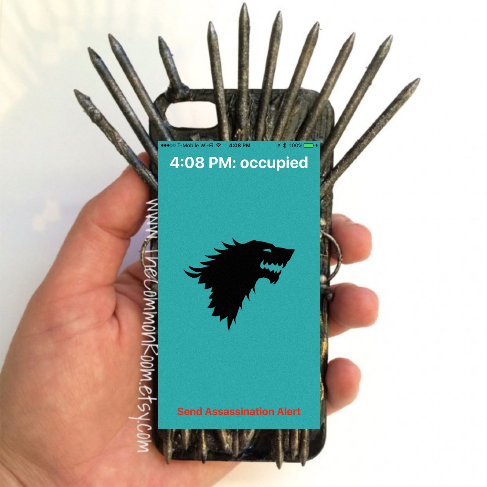

^ This is my work in progress for my CocoaConf 2016 presentation. This file is Markdown specifically formatted for presentation in Deckset, so it may look a bit funky if you're viewing it on GitHub.

# A Game 
# of Things
## (W)inter(net) is coming.

^ Introduction: I'm Sean McMains. I'm an Associate Director of iOS at [redacted] here in Austin. Until very recently, we were Mutual Mobile, but figured that six years old was about the right time for a tech company to have a midlife crisis, so we bought a convertible, got highlights in our hair, and changed our name. 

^ No, seriously, it's actually a pretty exciting time for us. We're expanding our focus beyond mobile into more of full-service operation, and have changed our name and branding to reflect that.

----


^ The Iron Throne

^ So, anytime you reference A Game of Thrones in a technical presentation, you have to include a photo of The Iron Throne for at least seven minutes. It's a law now. Congress passed in in 2014. Look it up.

^ Incidentally, one of the first results I got when I searched for "The Iron Throne" on Google image search was this. I thought it was pretty funny.


----


^ And yes, that was only three slides to get to a toilet joke. That's my new record for a CocoaConf talk.


----


^ But this talk isn't *about* A Game of Thrones. It's about the Internet of Things, and how to build stuff for it. But congress passed that law about the picture of the throne! And I don't want to make you all complicit in a federal crime. So, because I've got to get on with my topic, but have to keep this image up for six and a half more minutes, I present to you…The Connected Iron throne.

----


^ The Connected Iron Throne

^ Why would anyone want a connected throne? Well, this one tracks your ruling activity. If it notices you haven't gotten up for an hour, it pushes a notification to The Iron Phone (see what I did there?) to remind you to stand up and behead someone. 

----



^ Update this to show a push notification on the lock screen.

----


^ It also has a vibration motor that anyone in your court can trigger to let you know that you're in danger of assassination (king looking back, "Huh?!" balloon). Finally, it has a patented Hindquarter Identification System that allows it to recognize when a new person sits in the throne and notifies the court of the latest regicide. (Some sort of Butt ID graphic.)


----

# [Fit] Diagram Here


----


# [Fit] Sensors & Actuators

^ We have to be able to detect when the throne is occupied, so we'll install a pressure sensor under the seat of the throne. We also need a vibration motor, which we'll attach to the throne's frame as well. And finally, the Hindquarter Identification System has a serial connection that transmits a HUID (Hindquarter Unique Identifier) whenever someone assumes the throne.

^ Fancy word: an actuator is simply a motor that moves things or causes an action to take place under electronic control. Sensors and actuators are, therefore, essentially the input and output for your IoT device.

----


# [Fit] A Microcontroller
##\(with wireless)

^ A microcontroller is simply a fancy word for a tiny computer. Since they're designed to interact with sensors and actuators, most of them have a bunch of input and output pins. To create an IoT device, you need some way to connect to other things. Therefore, a wireless connection of some sort is essential. Bluetooth has the advantage that it's low power, but Wifi allows your device to connect to the Internet directly without having to have a bluetooth host nearby to act as a bridge. We'll look at options for both of these.

----


# [Fit] A Backend Service

^ For your device to be truly useful, it will very likely need some kind of backend service. This allows your device to send information somewhere. The backend receives that data, typically via a web service call. It can respond to it by logging it, making it available via a web service, sending push notifications, and creating reporting charts and graphs. The backend is essentially the communication hub for your Connected Throne service.

----


# [Fit] The Client

^ The client is typically a mobile or desktop computer that interacts with the backend service. In our use case, we have two kinds of clients: that of the King, who gets alerts when he hasn't brutally killed someone recently, and that of the court, which get alerted when someone new ascends to the throne, and can warn the king when an assassination attempt in immanent. Thus, our whole system together looks like this:

----

# [Fit] Microcontrollers

^ There are many available. We'll be covering some of the most popular options here, but there are dozens of other boards available that could be used. But I would personally recommend sticking with one of the more popular options, as you'll be able to find much more information out on the Internet to support your efforts.

----


##[Fit] Arduino

^ Open-source hardware & software. Myriad hardware options available, some starting at about $8. Comes with its own Java-based IDE. Uses the Processing language, which is C-like and easy to get the hang of. First arduino introduced in 2005, rapidly became a hobbyist favorite. Connectivity is a bit of a challenge and gets expensive (wifi shield $40-$50), but there's a ton of support out there for it.

----

# [Fit] Light Blue Bean

^ Because it's an open-source platform, there are *lots* of Arduino-compatible spinoffs available as well. One we've had particular fun with is the Light Blue Bean, which has Bluetooth LE support built in to it, and can run for months on a single coin cell battery.

----

.jpg)

## [Fit]Raspberry Pi
 
 
^ Complete ARM computer on a board for $35. Usually runs Linux variants, though Windows 10 and Android are available on it as well. Mix of open and closed source. Hugely popular, has a ton of I/O and decent processing capabilities. First introduced in February 2012, Raspberry Pi 2 in 2014. Requires $10 USB wifi dongle to get it on a network. One can develop for it using a wide variety of languages.
 
----
 
 
 
##[Fit] Photon/Electron

^ The Photon and Electron are Particle.io's development boards. The Photon is $19 and has wifi built-in, while the new $39 Electron has a cellular radio and a SIM card for data transmission. They use a similar Processing language to what the Arduino uses, and can be programmed over the air using Particle's web-based IDE. Unlike the other controllers, these boards are designed to work with a single, particular backend: the free Particle.io service.

----


##[Fit]Grove

^ You may also bump into the Grove ecosystem as you work with IoT projects. Grove is essentially a combination of a base shield that can work with a variety of microcontrollers and modularized components, bringing a good deal of plug-and-play ease to prototyping projects. There are Grove interface boards for each of the platforms listed above, and the modular sensors and actuators will work with any of the platforms.

----

# Backend Services

 - Particle.io
 - IBM IoT Foundation
 
----
 


^ Micosoft Azure IoT: http://www.microsoft.com/en-us/server-cloud/internet-of-things/azure-iot-suite.aspx. Provides Monitoring, Asset Management, and Analytics/Predictive Maintenance. Tailored and well-suited to things like utilities, installed machinery (like elevators), factory monitoring and automation, etc.

----


^ IBM's offering is similar to Microsoft's: enterprise grade services with an emphasis on large-scale management. IBM has an excellent presence here locally, and actively supports the iOS community, so they're definitely one I would look at if I were targeting a large-scale implementation.

----
# [Fit]AWS

AWS IoT: https://aws.amazon.com/iot/
 - Many other good backend services (Lambda, e.g.) that could be used for IoT, but which aren't tailored for it.
 
---- 


^ Another service you'll want to be aware of as you're developing your solution is IFTTT, short for "IF this THEN that". It's a terrific service that allows mere mortals to set up conditional logic, and which has integrations to a huge variety of services. If you want to trigger a Hue light to turn red and text the paramedics your GPS location when you log a 180/110 blood pressure on your Withings blood pressure cuff, IFTTT is the glue that makes this easy to do.

----
# Client

^ So, let's talk about the client. In our case, since this is CocoaConf, we'll be considering how to write client for iOS. Our approach will vary depending on the comnmunication technology we're using. For BLE connections, CoreBluetooth will allow us to talk to the device directly. If we're connected over Wifi, we'll likely use REST calls, either to the device directly, or to the backend service. In addition, many services provide an SDK to make talking to their systems even easier.

----

# [Fit]Let's Build It!

^ So now we know what pieces we need. Let's start to put this thing together! For our stack, we'll be using standard sensors and actuators. For the microcontroller, we'll use the Photon. Its built-in wifi and reasonable price make it an attractive option for us. (Plus, I wanted an excuse to buy one.) We can use 


----


#[Fit]Pressure Sensor

----

```c
int Senval=0;
int Senpin=A0;

void setup()
{
    Serial.begin(9600);
}

void loop()
{
    Senval=analogRead(Senpin);
    Serial.println(Senval);
    delay(200);
}
```